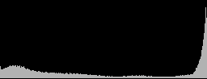

# Reading the image, and drawing on the screen

The goal is firmware extensibility: native controls, custom functions, image
analysis and sensor information. More sensor-mode experiments are not the current
priority. This is a scope decision, not a claim that Sigma exhausted the hardware.

Original fp, firmware 5.02. Evidence below distinguishes earlier camera observations,
upstream reports, offline instruction traces and proposals. RAM patches are not a
firmware flash. A battery pull clears RAM, but an installed AutoRun card can apply
its payload again on the next boot.

## Existing building blocks and limits

| Capability | Evidence and boundary |
|---|---|
| Card-loaded code | Existing AutoRun/VSHL payloads; not a general module loader or SDK. |
| Key hook | Published handler pointer `C091EA38`, stock handler `C0265800`. Existing RIGHT/UP controls remain. |
| On-screen text | Existing payload invokes shell-style handlers `C03E4620` and `C03E3D00`. These are not established `draw_text(x,y,string)` APIs. |
| Resident work | Firmware thread-pool creation at `C036E108`; existing gyro implementation demonstrates the pattern. Task context and ownership still matter. |
| Property changes | Several `menu` properties have been exercised. `analysis/menu_setters.json` contains candidates, not a verified callable API for every entry. |
| Native captions | NBU `drawText` key replacement was visually confirmed. Changing English.nloc strings alone had no observed menu effect. |
| Native destinations | Zebra Right/OK could enter False Color, but Menu/back then failed. Experiment restored; not a safe general remapping API. |
| Native toggle | Slideshow Repeat Yes/No tracked byte `C31ADA36` on the tested boot. Payload polls its edges on key events, not continuously. Real slideshow behavior is not disabled. |

## Prefer the existing detection feed for a first histogram

Ijigen's fpSup reports a **320x240, linear 8-bit grayscale detection channel** at
`C375D8C0`, already transferred through hook-push. Our subsequent hardware sample
below independently confirms grayscale image access, at **320x180** in the tested
camera state, not a universally fixed 320x240 raster:

- [fpRemote source](https://github.com/ijigen/fpSup/blob/main/projects/fp-remote.md)
- [raw-sup source](https://github.com/ijigen/fpSup/blob/main/projects/raw-sup.md)
- Local copies: `reference/fpSup/projects/fp-remote.md` and `raw-sup.md`.

Our offline trace independently resolves the descriptor address:

```text
C0436590()                          -> image manager C375D840
C0436F00(manager, channel_index)    -> manager + 0x18 + 0x34*index
channel_index = 2                  -> descriptor C375D8C0
```

`C0436F00` does not bounds-check its index. Constructor `C0436608` creates four
0x34-byte entries. `C0436538` writes each entry's first word from its buffer
argument, copies 44 bytes of source description into entry+4, then stores a
channel flag at +0x30. **C375D8C0 is a descriptor, not the address of pixel zero.**
Its geometry layout is different from the QR descriptor below; do not reuse that
layout by address similarity.

This feed is the preferred first candidate for a luminance histogram, not proof
of raw-sensor linearity, clipping, transfer function or RGB histogram fidelity.
False-color exposure thresholds need calibration to the actual image path. The
upstream timing figures describe transfer work, not sensor frame rate.

### First local hardware image sample, 2026-09-14

After USB reconnection, read-only shell access returned this slot-2 descriptor:

```text
4483C340 00000140 000000B4 00000000 00000000 00000140 000000B4
00000003 00000004 00012C00 00000001 00000000 00000020
```

The first word pointed to `4483C340`; width/height words were 320 and 180.
Reading 57,600 bytes and interpreting them as row-major 8-bit grayscale produced
a recognizable scene image. Descriptor word +24 was 76,800; it must not be used
as the active width*height byte count. Its exact allocation/layout role remains
unresolved. The camera reported MONIT1_60 standby, sensor size 2016x1344.

Those artefacts (the frame, a host-rendered plot, and the descriptor with all
256 bins) stay in the local `analysis/` folder, which this repository does not
publish: it is the same folder the firmware image lives in.

Transfer used `mem get` in checked, ordered 1,024-byte chunks. It took about
1.01 seconds; the descriptor was identical before and after. **This is a rolling
live-buffer sample, not a guaranteed coherent single frame.** An unchanged
descriptor does not prevent pixels from changing during the read.

The histogram accounts for all 57,600 sampled pixels. 62.4% have code 255 in this
bright sample; this is not a measurement of raw-sensor clipping. The plot is
rendered on the host, not an overlay installed on the camera. No memory writes,
code injection, card writes or recording-mode changes were made. Shell ping still
responded after acquisition.

## QR path: concrete access trace, not a frame lease API

The QR implementation provides another route and useful ownership evidence.
All findings in this section are offline disassembly unless stated otherwise.

### Control and scheduling

```text
qr lv_read                         C0407048
  object accessor                  C0370CF8 -> C0371730 -> C351FE88
  constructor                      C03716F0 installs vtable C0B9928C
  shell reader                     C0406E78
    register observer              slot +98 -> C0372898 -> C03A0C68
    enable                         slot +84 -> C0372740, message 1A
    request                        slot +88 -> C0372790, message 1B
    poll completion                at most 20 sleep calls, argument 50
    disable                        slot +84, argument 0
    unregister observer            slot +9C -> C03728B8 -> C03A0D20
```

Both message wrappers put byte 1 at message+4. `C03A0798` copies and queues the
request and returns without waiting for completion. Slot +88 returns a truncated
status value, **not a frame pointer**. The first dispatch table is verified:
`C0B9E1D4` routes 1A to `C03A2040`, and `C0B9E1E4` routes 1B to `C03A2098`.
Both forward to a second queue through `C03A9580`.

**One dispatch link remains unresolved:** `C038ACA8` uses initialized RAM table
`C2F1F5A0`. Entries for 1A/1B are `C2F1F740`/`C2F1F750`. Same-offset bytes in the
extracted MAIN file are not valid final table records. Do not infer their contents
from adjacent handlers. Candidate concrete state handlers `C03ABE38`/`C03ABE60`
are referenced together in 13 state vtables and implement the matching lifecycle
and trigger contracts, but the RAM table must establish their selection.

The concrete QR worker is independently traced:

```text
QR object C3588D30
  C0381588                         enable under QR mutex +4
  C03815C0                         reset decoder and disable under same mutex
  C0381600                         attach work when enabled
  C036EFE8                         thread loop invokes work vtable +0C
  C0381460                         QR work body, holds QR mutex
    C0423C48 -> C0423E48            require producer state == 3
    C0423E28 -> C0429560            obtain borrowed image descriptor
    C02E9278                       shallow descriptor copy
    C05C4878 -> C05C48A0            grayscale preparation and decode
    C03A0C40                       notify observers before unlocking
```

### Producer descriptor and ring selection

`C0429560` rebuilds static descriptor `C375C094`. It returns an empty descriptor
for producer states 0, 1 and 5; the QR caller separately requires state 3. Otherwise
it scans driver channels 0..2 for the first metadata record whose first word is 0.
No matching channel produces an empty descriptor.

Thumb function `C01D7638` refreshes ring indices through MMIO accessor `C01822B8`
and copies a 0x80-byte metadata record from `C30255B4 + 0x80*channel`. The getter
uses record+0x0C/+0x10 as dimensions, record+0x7C as the selected index, and the
word-addressed buffer vector at record+0x24. `C0022FB8` converts a selected word
address to `(word_address << 2) + 0x40000000` using 32-bit arithmetic, after
asserting the word address is below 0x40000000.

No buffer reservation, reference increment or release is present in this getter.
Its static descriptor is overwritten on another call. A shallow copy stabilizes
the description, not the pixels. Neither the QR mutex nor a fast memcpy has been
shown to prevent the producer from reusing a frame during consumption.

### QR descriptor layout and byte counts

Analytical field names, not recovered SDK types:

| Offset | Input descriptor field |
|---|---|
| +00, +04 | Raster width, height |
| +08, +0C | Crop origin x, y |
| +10, +14 | Crop width, height |
| +18 | Unknown |
| +1C | CPU data pointer |
| +20 | Unknown |
| +24 | One-byte layout flag; +25..27 are not copied by the copy helper |
| +28 | Total-size override, not a stride |
| +2C | Auxiliary field; getter copies producer+54 for channel 0 only |

`C02DA6E0` returns the source dump size, with firmware uint32 arithmetic:

```text
layout_flag != 0:  ((width + 15) >> 4) * ((height + 7) >> 3) << 7
otherwise:         size_override if nonzero, else 2 * width * height
```

The flag branch suggests 16x8-block storage, but does not establish tile traversal
or compression. The default size does not prove YUYV, UYVY, chroma ordering or a
universal row stride. Do not write a host YUV decoder from this formula alone.

The grayscale descriptor is 0x24 bytes: six geometry words, +18 zero, +1C allocated
pixel pointer, +20 mode 1. `C02DA750` computes its byte count as width*height. The
allocation and decoder arguments support tightly packed one-byte grayscale;
orientation, range and pixel content remain unverified here.

### Conversion, dump and lifetime

`C03C7E60` only constructs a descriptor. It does not convert pixels.
`C05C48A0` allocates grayscale storage through `C001D800` and invokes conversion
through `C04278B0 -> Thumb C01B5C88`. The conversion uses the **original input
descriptor**, not the locally crop-adjusted copy used for output-size selection.
The 0x120-byte low-level parameter block contains encoded word addresses, source
raster/crop dimensions, output dimensions and layout/mode fields. The low-level
path configures shared converter state; it is not a CPU luminance-extraction loop.
Hardware completion and cache-coherency contracts remain unresolved.

The grayscale pointer is used by the decoder and dump calls, then freed through
`C001D8F8` at `C05C49E0`. It must not be retained by a custom asynchronous consumer.
The runtime output-dimension cap at `C2F2D8E8` also cannot be read as final data from
same-offset MAIN bytes. No fixed QR output dimensions are established.

`qr dump_yuv on` / `qr dump_y8 on` set bytes `C37CE91A` / `C37CE91B`. Their parser
accepts exactly one argument equal to `on`; other forms clear the flag. These are
persistent flags, not capture commands. The decode path consults them and calls
`C05C3F98(path, data, byte_count)` before decoding. Generated names have the form
`\QR_LOG\LOG_dddd.YUV` / `.Y8`. The helper opens with firmware flags 0x406,
attempts one raw write and closes. Selected medium, collision/overwrite semantics,
short-write handling below this layer and durability are not established. **No
dump commands were run in this investigation.**

### Observer ownership is not image ownership

Registration, unregistration and observer invocation use the same service+0x38
lock. Unregister clears all matching active slots; returning from it excludes an
in-flight callback under the inferred mutex semantics. Merely submitting disable
does not drain either queue or prove that a worker finished.

The callback receives a temporary notification and runs while QR, notification and
observer-list locks are held. Keep it bounded; do not synchronously reenter QR
work or registration without proving lock recursion. Copy needed results before
returning. The observer's QR result pointer is not a pixel-buffer ownership token.

## Reproducible offline checks

```sh
.venv/bin/python frame_access_probe.py
```

This executes original firmware instructions in Unicorn with a SHA-256 identity
guard. It covers concrete vtable dispatch, successful/timeout shell cleanup,
completion-event filtering, producer states and channel selection, word-address
translation, detection-slot indexing, and dump-size precedence/block rounding.
Services, allocation, sleep, output, memory helpers and the hardware index accessor
are stubbed; metadata is synthetic. **Passing is not hardware capture, converter
execution, scheduling or concurrent-buffer proof.** The script imports no camera
transport and cannot deploy a payload.

For instruction inspection, use `.venv/bin/python af_dis.py dis ADDRESS COUNT`;
append `t` for Thumb. Relevant anchors are listed above. The probe checks MAIN hash
`92a8ee993f6c3d66c251e88d45a2ccd5135c6cf7342717784321c2ed506e2fb4`.

## A menu drawn by our own code, 2026-09-14

`src/menu_overlay.S` puts the card menu's whole option list on screen at once,
with the row the camera's cursor is on highlighted and each option's real state
beside it. It carries its own 5x7 font (`tools/make_font.py`), so it writes
characters anywhere in the layer with plain byte stores: no firmware text call,
no fixed rectangle, no display lock. The firmware's own text handler renders
into a rectangle it hardcodes, which is exactly why the card menu shows one row.

It **reads** menu.S's state block at `0xC072FB00` and never writes it. RIGHT and
UP still belong to the card; this is a display for state that already exists.

**One thread draws both overlays.** The menu renderer is a function pointer in
the histogram's state block, called after each pass. That is deliberate: a
second thread, spawned from the shell's own dispatcher, preceded a session where
the shell stopped answering, and drawing never needed its own thread. The cause
of that stall was never established, so the design removes the suspect rather
than claiming a diagnosis.

## Changing camera settings from our own code

The overlay thread can also apply a camera setting, using the camera's own
property call rather than the `setting` mirror:

    r0 = 0xC0057AE8()      the settings object
    r1 = value, r2 = 1
    blx property_fn        one row of analysis/menu_setters.json

The host queues a request in the menu state block (`+0x48` function, `+0x4C`
value) and the thread performs it on its next pass, clearing the request first
so a fault cannot become a loop of writes. Only addresses inside the firmware
image are accepted.

Measured on hardware: `SetMovFramerate` (`0xC005C0B8`) driven from the thread
moved the camera from 3 to 5 and back, confirmed through the camera's own getter
and `gui geti MV_FrameRate`. `tools/overlay_deploy.py set --setting framerate
--value N` is that path.

This is the mechanism an option needs to select its own preset instead of asking
you to switch the recording preset away and back. **What is still missing is the
mapping from that enum to an actual frame rate.** The firmware's own label lists
are ids `0316..` and `1281..` (23.98, 25, 29.97, 50, 59.94, 100, 119.88, with 24
and 48 elsewhere), and some values are refused or clamped depending on the
current format, so the mapping has to be read off the camera rather than
assumed. Until it is, no option sets a preset by itself.

## Frame ownership: DMA only, no lease

The detection path was traced to its producer and consumers. There is **no
software mutex, no buffer flip and no completion signal** in it. Manager
`C375D840` holds four 0x34-byte entries; the source object at `[mgr+0x14]` was
read live as `C375EB68`, vtable `C0BD0318`, and its accessors `C0437E98`,
`C0437ED8`, `C0437F20` are all non-blocking lookups. Entry `+0x30` is a channel
type mask (detection `0x20`), not a ready bit, and `+0x20` is the allocation
size: detection is allocated `0x12C00` (320x240) while only 320x180 is active.

So the descriptor pointer is stable while the ISP keeps overwriting the pixels
behind it. That is exactly why the earlier one-second host read was incoherent.
A guaranteed single frame needs a copy taken on the display task's frame
cadence; the true write-complete interrupt is upstream and was not identified.

## A live overlay drawn by our own code, 2026-09-14

`src/hist_overlay.S` runs inside the camera, RAM only, deployed by
`hist_deploy.py` over the USB shell:

```sh
.venv/bin/python hist_deploy.py place    # payload into the pool, surfaces measured
.venv/bin/python hist_deploy.py once     # a single pass, to check before going live
.venv/bin/python hist_deploy.py start    # the resident thread
.venv/bin/python hist_deploy.py stop     # ask it to exit, then its code can be replaced
```

**Read this before being impressed: the camera's built-in histogram is better,
and the fp already has false colour.** This is not a better exposure tool. What
it demonstrates is the thing the camera does not otherwise offer: our own code
reading the image and drawing arbitrary pixels on screen, on its own thread.
That is the foundation for tools the fp lacks; the histogram is only the
smallest honest proof that every link in the chain works.

How it works. The payload bins the detection feed and paints bars straight into
the OSD layer's buffers. It never fills the layer and never presents. The
surface contract came from the shell itself: `display osd 1` prints
`addr 0x%08x (%04d,%04d)`, reporting three rotating buffers (`0xC66A9A00`,
`0xC6754200`, `0xC65FF200`) at 1024x682. Buffer spacing is exactly 1024*682, and
drawn glyph pixels read back as `0xB2`, so the layer is **one byte per pixel with
the surface width as its stride**.

Two ways in, both implemented. With no override the payload asks the drawable
for its backbuffer (`C03E5698`, `C03E56D8`, vtable `+0x10`, base at `+4`,
geometry at `+8`) and the host presents afterwards. With the buffer addresses
supplied it paints **all three directly and calls no firmware drawing code at
all**, which is what the resident thread uses: no display lock, so it cannot
deadlock against the camera's own UI. Everything is range-checked and a bad
value produces a status code, not a wild write. Each pass ends on `C000E91C`.

The thread is the firmware's own pool thread (`XT_CREATE` at priority 20,
`XT_ATTACH`), looping on `tk_dly_tsk` until a host-set stop flag lets it return
cleanly. Measured 5.5 to 12 passes per second painting all three buffers.

**Painting one buffer was a real bug, not a theory:** the plot vanished the
moment the camera's UI presented a different buffer. Only the UI decides which
one is on screen, so a resident pass has to paint all of them.

Verified run: pixels `0x4483C340`, 320x180, 57,600 samples, status 1, and
reading the presented buffer back, **all 256 bar heights equal the payload's own
bins** with the baseline row present.



That is a read-back of the buffer the camera presented, not a mock-up. The
payload's full state and bins stay in the unpublished `analysis/` folder.

Honest limits: the detection feed has no frame lock, so a plot can straddle two
frames. The values are display-path grayscale codes, not calibrated raw
clipping. A mode change wipes the layer. There is no menu entry and no card
build, so it needs the USB shell and a debug card, and a battery pull removes
it entirely.

## Next

1. Copy the feed on the display task's frame boundary so a plot comes from one
   frame, instead of relying on a fast pass over a buffer nothing locks.
2. Check the feed's dimensions across camera states: upstream reports 320x240
   where this camera showed 320x180.
3. Give the overlay a card build and a menu entry, so it does not need a host.
4. Only then build a tool worth having, calibrated against what the camera's own
   display and exposure tools already show.

A module ABI remains a design proposal. Before exporting frame callbacks it needs
format/stride metadata, ownership and release rules, task-context restrictions and
failure behavior. Native menu return navigation also needs a real fix. Pixel
access is not the only missing piece, and a stable plugin SDK has not been built.

## False colour, latched instead of held, 2026-09-14

The camera only offers false colour as a button you hold. It is not a stored
setting at all, which is why turning it on moved nothing: not `pic_false_color_on`,
not `CM_FalseColor`, and not one byte in a 128 KB diff of the settings store.

The function key calls **CameraIF vtable +0xCC** (`0xC03722E8`), which posts
rec-manager event **0x21** (`INTR_START_FALSE_COLOR`); releasing calls **+0xD0**
(`0xC0372330`), posting **0x22**. The request is built on the stack and posted
through `0xC03A0798`, so nothing persistent is written anywhere. Event numbering
is cross-checked: the neighbouring custom-key entry (AP preview) emits 0x1F/0x20
from the adjacent slots. `SetFalseColorType` (`0xC005DBA0`) is a separate thing --
it picks the style, gray/half/stop, and cannot switch the effect on.

`gui send INTR_START_FALSE_COLOR` returns OK and does nothing: those strings are
log-parser text with no code pointing at them.

**Confirmed on hardware:** posting 0x21 from our own code turned false colour on.
That makes it a latch rather than a hold, which is what a menu row needs.

## What froze the camera, and what did not

Four hard freezes, record light on and nothing responding. Causes, in order of
discovery, all now fixed or removed:

1. **Clobbering a handler argument.** Our key hook held a forwarding address in
   r2, one of the handler's own arguments. Pressing OK drove the camera into
   record and hung it. A second version counted events in r0, same class of bug.
   `tests/test_keyhook.py` and `tests/test_keygate.py` now check that r0-r3
   survive every path, for every key -- routing tests pass with the bug present.
2. **Publishing our own function in the observer vtable at `0xC091EA38`.** That
   slot belongs to a C++ observer whose contract we do not have. Replaced by
   patching the card's own handler entry to branch to a gate, which runs in the
   same context with the same registers.
3. **Creating a pool thread from the key handler.** That handler runs in the
   camera's UI path; a blocking call there takes the whole camera down.
4. **Creating a pool thread at all** is the remaining suspect for two USB stalls.
   The overlay no longer uses one: it repaints from the key handler, which is
   the only moment the panel can change, and where the camera's own function-key
   code already runs.

## While recording: false colour and the focus PIP, 2026-09-14

Both are disabled during a take. They fail for different reasons and only one
of them looks fixable.

**False colour: the request is accepted and has no effect.** Measured on the
camera with a resident watcher, because the shell cannot be used during a take:

- the rec state machine's state index does NOT change when recording starts. It
  stays 1, which is the state whose vtable slot +0x6C holds the real handler
  `0xC0394240`. An earlier reading of "state 4" was a transient value sampled
  mid-transition; patching state 4's slot achieved nothing, and leaving that
  patch in place is the likely cause of a crash at record start.
- the three checks inside the handler all stay permissive for the whole take:
  the object at `0xC3074BE8` reads `+0x44 = 1`, `+0x328 = 0`, `+0x330 = 0`
  throughout. The `+0x44 == 2` bail-out never fires.
- posting event 0x21 once a second from our own thread is accepted every time
  (returns 1) and produces nothing on screen. Stop recording and false colour
  comes back by itself.

So nothing on the request path refuses. The remaining explanation is that the
effect belongs to the standby live-view pipeline, and during a take the monitor
is fed by the record path instead -- the same split already documented for the
green preview. That is a missing stage, not a flag, and no amount of asking
will produce it. Anyone picking this up should start by establishing whether the
record monitor path has any false-colour or LUT stage at all.

**The focus PIP: cancelled at record start, which is more promising.** Three GUI
variables mirror it, all going 0 -> 1 when it is up and back on record start:
`LV_MagnifyStatus`, `CM_AFMAG_MagnifyDisplay`, `CM_MFMAG_MagnifyDisplay`
(`LV_FocusMode` is a fourth input). The camera's own display condition takes
exactly those four. Confirmed by the owner: the PIP vanishes the instant
recording starts.

`LV_MagnifyStatus` is a MIRROR, not a switch: `gui seti LV_MagnifyStatus 1`
answers OK and reads back 0 immediately. Forcing it will not summon the PIP.

### Resolved, 2026-09-14 (static, from MAIN): magnify is a live-view MODE bit

`LV_MagnifyStatus` has exactly one writer in the image, and it is not a state
flag anyone can set. The chain, every edge read as ARM in `MAIN_c0000000.bin`:

1. GUI content-model vtable `0xC2DF5AEC`, slot `+0x1B0` = `0xC059E5C8`, which
   publishes the name `LV_MagnifyStatus` (string `0xC2DF5538`) through the
   generic setter `0xC059CCC8`. Nothing else publishes that name.
2. Slot `+0x1B0` is called from exactly one place in the standby live-view
   module: `0xC0480034`, inside `0xC047FEB8`, whose RTTI name is
   `StandbyLiveViewMovsigStateObserver` (`0xC0CD7454`). It is a MovSig state
   observer, notified with a state code; it acts on codes 1 and 2 only.
3. That observer is created and registered by the zoom state on entry:
   `ZoomEnter` (`0xC0480C90`) -> `0xC0481AC0` -> `0xC0423D88` -> MovSig core
   list. `0xC0481AC0` also latches `observer+8 = (zoom state id == 3 or 5)`,
   which is the auto-magnify pair `AfAutoZoom`/`MfAutoZoom`.
4. The value published is read from the shared camera-state snapshot at
   `+0x23C`: `0` -> publish 0, non-zero -> publish 1, and 2 when `observer+8`
   is set. So the GUI variable is a mirror of that word, three states deep.
5. Snapshot `+0x23C` is written only by the group publisher `0xC0017F88`
   (dirty bit `0x400000`), whose writers are `0xC031B7C4`, `0xC0428B68`
   (MovSig start), `0xC0428EE4` (MovSig stop, clears the active byte and
   leaves this word), `0xC0436B68` (geometry change).
6. MovSig start takes the word from its own core `+0x18`, computed in
   `0xC042A570`: `1` if live-view-param flag bit 4, `2` if bit 5, else `0`.
7. Those flags are not runtime state either. They are a pure function of the
   live-view MODE ID stored at param `+0`, built once in the param constructor
   (`0xC043A158` -> cache at `+0x168`) by `0xC043A1C8`:
   - bit 0: id 1..3
   - bit 1: id 5..0x0B
   - bit 2: id 0x65..0x80, 0xBF..0xC5, 0x12D..0x138, 0x191..0x1A0
   - bit 3: id 0x83..0xBD, 0x1A1..0x1B2
   - **bit 4 (AF magnify): id 0x1D..0x28**
   - **bit 5 (MF magnify): id 0x11..0x1C**
   - bit 8: `param+0xE0 == 0x0B`

So the focus PIP is not a flag that record start clears. Magnification is a
*class of live-view modes*: ids 0x11-0x1C are the MF-magnify modes and ids
0x1D-0x28 the AF-magnify ones. Entering magnification swaps the live-view mode
to one of those; recording runs a mode outside both ranges, its param flags
carry neither bit, MovSig publishes kind 0, and the observer publishes
`LV_MagnifyStatus = 0`. Forcing the GUI variable cannot work, which matches
`gui seti` reading back 0.

In this project's vocabulary the id at param `+0` is the **selector** already
used by the green-preview work (`0xC043A158`, `profile = u32(0xC0BD05D4 +
selector*4)`, selector 175 -> profile 122 = stock FHD/29.97). Reading that same
table for the magnify selectors gives the profiles the loupe actually runs:

| selector | 0x11 | 0x12 | 0x13 | 0x14 | 0x15 | ... | 0x20 | 0x25 | 0x28 |
| profile  | 8    | 9    | 10   | 11   | 12   | ... | 23   | 24   | 27   |

(selectors 0x21-0x24 are `0xFFFFFFFF`, i.e. unused.) Cross-referencing
`reference/fpSup/gyro/analysis_imx410/imx410_mode_geometry.csv`: profile 8 is
2016x1344 @60 with sampling 3/2/3/3, profile 10 is 6064x2022 @60 sampling
1/1/1/1, profile 11 is 3032x2012 @105, profile 12 is 2016x672 @240, profile 27
is 3032x1708 @60. These are **distinct sensor readouts**, not overlays.

That settles the question the earlier note left open. The PIP is not torn down
by a call in the record path that could be suppressed; magnification is a
sensor readout mode, and during a take the sensor is running the record profile
(122 for FHD/29.97, 127 for FHD/25). Nothing in the GUI layer can re-create it.

Two levers remain, both one-word, both unverified on hardware, both risky
because the selector also chooses the readout:

- widen the range test at `0xC043A29C` (bit 4) or `0xC043A2B8` (bit 5) so the
  record-time selector also carries a magnify bit. This is NOT cosmetic: the
  two bits have ~13 consumers each, including the sensor/driver path
  (`0xC02A9238`, `0xC02A0034`, `0xC02A285C`, `0xC02A4644`) and the geometry
  builder (`0xC031B0D0`, `0xC031B3FC`) as well as MovSig (`0xC04293DC`,
  `0xC042941C`). Setting the bit for a record selector tells all of them to run
  the magnify crop while the profile's raster stays the record one -- a
  geometry mismatch, i.e. the class of change that has frozen the camera before;
- or make the record path request a selector inside 0x11-0x28, which really
  does magnify but replaces the recorded geometry with that profile's -- the
  same class of change as the existing mode swap, and it would change the take,
  not just the monitor.

**Second, independent finding: the UI refuses the MF ring in movie mode.** The
MF-ring handler is `0xC0484DD8` (scene vtable slot 48, `StandbyEventHandler_
w71c1`, vtable `0xC0CD7968`). It logs three named outcomes: `MfRing`
(`0xC0CD7328`), `MfRingSkip` (`0xC0CD733C`), and `MovMfR_Sk` (`0xC0CD7330`,
"movie MF ring skip"). The skip at `0xC0484EC8` is taken when movie mode is
active (`0xC04AE0B8`: snapshot `+0x1F4+0x1C == 2`, or `0xC04FBE20`) AND
`0xC0061218 == 0` AND `0xC0059D18 != 2` AND `0xC04A51B8 != 0` AND
`0xC04914A0 == 0`. Forcing the branch at `0xC0484EC4` (`bne` -> `b`) removes
that refusal, but it only lets the request through: the mode-id wall above
still decides whether anything appears.
